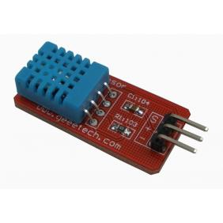

#DHT11 
 			

It is one of the most cheapest and most easily accquired sensor in the 
market with a good range for practical conditions.And has a wide support
as well as easy calculation of sensor data.

This DFRobot DHT11 Temperature & Humidity Sensor features a 
temperature & humidity sensor complex with a calibrated digital signal 
output. By using the exclusive digital-signal-acquisition technique and 
temperature & humidity sensing technology, it ensures high reliability 
and excellent long-term stability. This sensor includes a resistive-type 
humidity measurement component and an NTC temperature measurement 
component, and connects to a high- performance 8-bit microcontroller, 
offering excellent quality, fast response, anti-interference ability and 
cost-effectiveness.

###Specifications

###typical application

Note: 3Pin – Null; MCU = Micro-computer Unite or single chip Computer 
When the connecting cable is shorter than 20 metres, a 5K pull-up 
resistor is recommended; when the connecting cable is longer than 20 
metres, choose a appropriate pull-up resistor as needed.

reference from [wikipedia](https://www.wikipedia.org)
 
