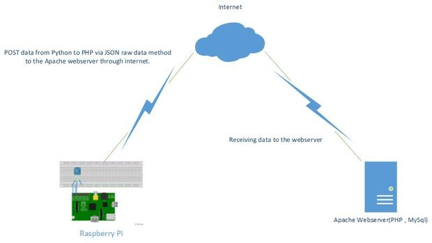

# Temperature-Humidity sensing and data loading 

##Abstract
To take up real-time values from teh desired location and push it up to the cloud database from where it can be accessed or processed to obtain the required data.It was decided to use Raspberry pi 2 as the embedded linux platform and DHT11 as the temperature and humidity sensor.

Here instead of the JSON or custom made Apache webserver we will be making use of [Ubidots](http://ubidots.com) 
