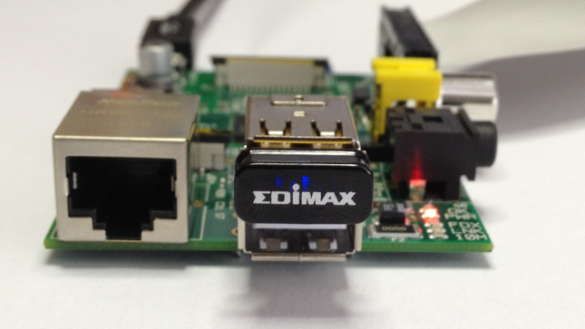

#Quick Start -beginer
There is a more detailed version for advanced users below this section
###What you will need
####Required

 * <b>SD Card</b>
   
We recommend an 8GB class 10 SD card – ideally preinstalled 
   with NOOBS. You can buy a card with NOOBS pre-installed, or you 
   can download it for free from our downloads page.
 
 * <b>Display and connectivity cables</b>
   
Any HDMI/DVI monitor or TV should work as a display for the 
   Pi . For best results, use one with HDMI input, but other 
   connections are available for older devices. Use a standard 
   Ethernet cable for internet access.
 
 * <b>Keyboard and mouse</b>
   
Any standard USB keyboard and mouse will work with your 
   Raspberry Pi.
 
 * <b>Power supply</b>
   
Use a 5V micro USB power supply to power your Raspberry Pi. Be 
   careful that whatever power supply you use outputs at least 5V; 
   insufficient power will cause your Pi to behave in strange ways.
 
 * <b>Additional addons</b>
   
we can also use an additional Wifi dongle in order to use the 
   wifi and therby reduce the the no of wires connected to the pi.
 
   
###Plugging in your Raspberry Pi

Before you plug anything into your Raspberry Pi, make sure that you 
have all the equipment listed above to hand. Then follow these 
instructions:

1. Begin by slotting your SD card into the SD card slot on the Raspberry
   Pi, which will only fit one way.
2. Next, plug in your USB keyboard and Mouse into the USB slots on the 
   Raspberry Pi.
3. Make sure that your monitor or TV is turned on, and that you have 
   selected the right input (e.g. HDMI 1, DVI, etc)
4. Then connect your HDMI cable from your Raspberry Pi to your monitor 
   or TV.
5. If you intend to connect your Raspberry Pi to the internet, plug in 
   an ethernet cable into the ethernet port next to the USB ports, 
   otherwise skip this step.
6. When you are happy that you have plugged in all the cables and SD 
   card required, finally plug in the micro usb power supply. This 
   action will turn on and boot your Raspberry Pi.
7. If this is the first time your Raspberry Pi and NOOBS SD card have 
   been used, then you will have to select an operating system and 
   configure it. Follow the [NOOBS guide](http://www.raspberrypi.org/help/noobs-setup/)
   to do this.

###Logging into your Raspberry Pi

1. Once your Raspberry Pi has completed the boot process, a login prompt
  will appear. The default login for Raspbian is username `pi` with the 
  password `raspberry`. Note you will not see any writing appear when you 
  type the password. This is a security feature in Linux.
2. After you have successfully logged in, you will see the command line 
  prompt `pi@raspberrypi~$`
3. To load the graphical user interface, type `startx` and press 
  <b>Enter</b> on your keyboard.

##Setup your Raspberry Pi
If you have already done a basic setup of your Raspberry Pi you can jump this section, otherwise follow these steps:

1. Download the Raspberry Pi operating system, we recommend Raspbian Wheezy.
2. Unzip the file and you’ll end up with a large IMG file: DON’T COPY AND PASTE THIS FILE INTO YOUR SD CARD, because it won’t work. You’ll need to write it properly to the SD card by following these steps according to your operating system: 
MacOS: [http://ivanx.com/raspberrypi/](http://ivanx.com/raspberrypi/) 
Linux: [http://elinux.org/RPi_Easy_SD_Card_Setup#Using_Linux_.28including_on_a_Pi.21.29](http://elinux.org/RPi_Easy_SD_Card_Setup#Using_Linux_.28including_on_a_Pi.21.29) 
Windows: [http://elinux.org/RPi_Easy_SD_Card_Setup#Using_Windows_7_or_Windows_XP](http://elinux.org/RPi_Easy_SD_Card_Setup#Using_Windows_7_or_Windows_XP) 
3. Plug a keyboard and a monitor through the HDMI or TV/Analog ports.

##Connecting your Raspberry Pi through WiFi.
Your Raspberry Pi already has an Ethernet port, however, it can be turned into a wireless device by adding a USB WIFI dongle.

Raspberry pi with USB WIFI dongle from EDIMAX 
 
Figure 1: Raspberry pi with USB WIFI dongle from EDIMAX 
First, we’ll need to make sure your device is connected to the web through your local WIFI network:

1. Plug the USB WiFi Dongle, then restart your RasPi.

2. Login to the device using your credentials, typically as follows:

		user: pi
		password: raspberry
Open this file from the console:

		$ sudo nano /etc/network/interfaces

3. Modify the file so that it looks like this:

		auto lo
		iface lo inet loopback

		auto eth0
		iface eth0 inet dhcp

		auto wlan0
		iface wlan0 inet dhcp
		wpa-ssid "YOUR WIFI NETWORK NAME"
		wpa-psk "YOUR WIFI PASSWORD"

4. Reboot your device.

		$ sudo reboot

5. Verify the WiFi connection. You must be able to see an IP address assigned to the ‘wlan0’ interface.

		$ sudo ifconfig wlan0
