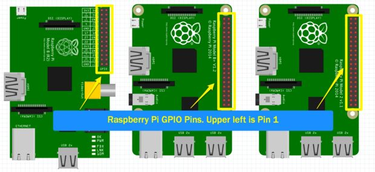
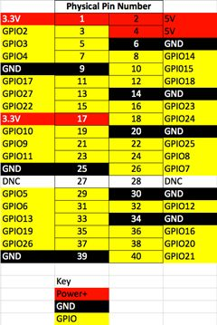

#RaspberryPi2

##Introduction
Raspberry Pi has become a widely used device, not only for prototyping and educational purposes, but also for production projects within companies.

Best described as a pocket-size $25 computer, it features all the components and peripherals needed to perform most tasks your desktop PC would do, like spreadsheets, word-processing and games.

Besides its small size, low cost and fully operational Linux OS, the greatest difference from your Destkop PC lies in its ability to interact with other peripherals through GPIO pins (General Purpose Input/Ourput Pins).

This allows you to code pretty robust hardware applications without having to be an expert in embedded electronics. 

#Understanding GPIO pins

GPIO stands for General Purpose Input/Output and on the Raspberry Pi they are the physical interface between the software side of the Raspberry PI and the outside world. We will need to use the GPIO pins to connect to the DHT11 and the Photoresistor.

Different versions of the Raspberry Pi have a different amount of GPIO pins. In early versions of the Raspberry Pi there were 26 pins and the more recent versions have 40 pins. Even though more pins were added, pins 1 through 26 are the same on all versions. When you look at a reference for Raspberry Pi GPIO pins you will will find several notations for each pin. Most commonly you will find one reference for the physical name of the pin (1 to 40) and the other for the GPIO Name (GPIO1, etc). The physical name is just that, the physical ordered number of the pin. With Python we will be using the GPIO reference for our pin identification. The GPIO Name is designated from the chip set and more commonly used in advanced projects.

Referencing the wrong GPIO Pin number is very common and if you are not getting the results you expect when working with GPIO, double check the pin you are connected to and the pin you are referencing in your code.

