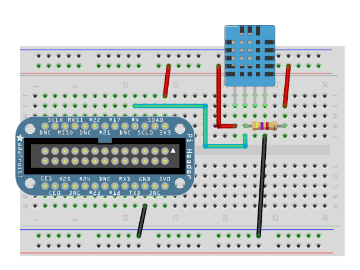
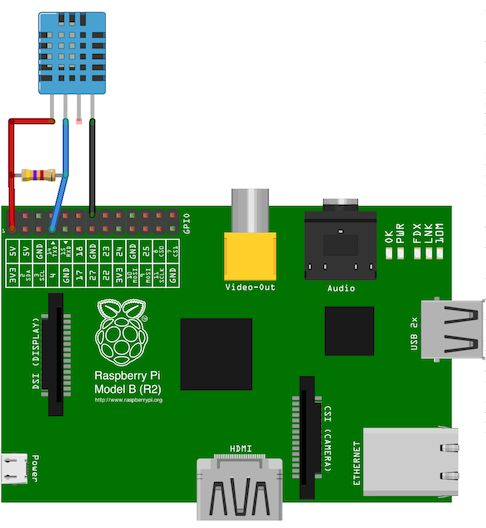

#Interfacing

###Wiring up the DHT Humidity sensors

Its easy to connect these sensors to your Raspberry Pi. Our code can 
use any GPIO pin, but we'll be using GPIO #4 for our diagrams and code. 
Once you have it working, you can simply adapt the code to change to any 
other GPIO pin (e.g. pin #18). You can also have as many DHT sensors as 
you want but they cannot share the data pin - each sensor needs a unique 
data pin!

For DHT11 and DHT22 sensors, don't forget to connect a `4.7K - 10K` 
resistor from the data pin to VCC

& if 4.7K doesnt work, try 10K
Now this is the layout on a breadboard.

Now as an example of the wiring we have the wiring of the DHT11 to an 
Older version of Raspberry pi.Here note that the connections are made to 
`GPO #4` as `DATA IN`.Along with + Vcc and GND.

Reference [AdaFruit-Logging using GDocs](https://learn.adafruit.com/dht-humidity-sensing-on-raspberry-pi-with-gdocs-logging/wiring).
