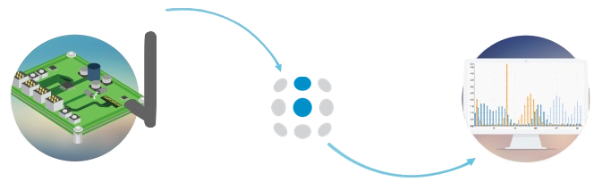
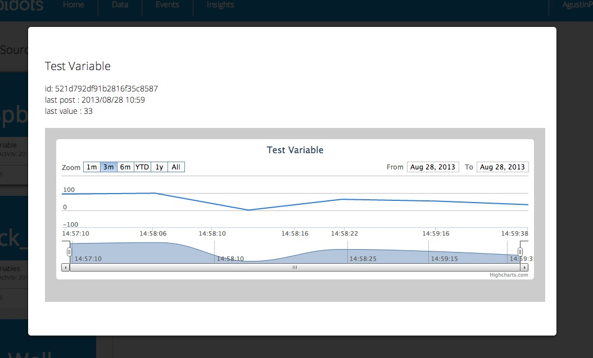

#Ubidots

###What is Ubidots?

Ubidots helps you create applications that capture real-world data 
and turn it into meaningful actions and insights.

They think that we shouldn’t have to be a web/data expert, or hire 
one,in order to stream your sensor data to the cloud and extract its 
full value through real-time visualizations.

###Glossary

Before you get started with our API, here are a few concepts your 
should get familiar with:

 <b> Data Source</b>
  
A data source is your connected device. Every data source can have 
  one or more variables, each one containing values in a time series. 
  For example, a “Smart Sprinkler” would be a data source, while its 
  variables would be soil humidity and temperature.

  
 <b>Variable</b>
  
A variable is a series of data that change over time. For example, 
  a bike’s variables could be speed and GPS.

 <b>Value</b>
  
The measurement of the variable at a given point in time. For 
  example, “the value of the room’s temperature was 70°F at 15:02:33 
  EDT”

 <b>Event</b>
  
Events are “IF ... THEN ...” statements that are triggered 
  depending of the last value of a variable. For example, you can set 
  your sprinkler to send you an SMS if the humidity level is above a 
  given value.

 <b>Widget</b>
  
Widgets are custom visualizations of your data that help you 
  extract the value of it. You can condense a whole data set into one 
  meaningful sentence, map or graph. For example, if a variable measures 
  how many people looks at a product on a shelf,then use the “Statement” 
  widget to display something like: “A total of 4.503 people have looked 
  at the monkey in the display case”.

  
##Ubidots Python API Client.

The Ubidots Python API Client makes calls to the Ubidots Api. 
The module is available on PyPI as “ubidots”.

To follow this quickstart you’ll need to have pyton 2.7 in your 
machine (be it a computer or an python-capable device), which you can 
download at [www.python.org](http://www.python.org/download/)

###Installing the Python library
Ubidots for python is available in PyPI and you can install it from the 
command line:

	$ pip install ubidots==1.6.3

Don’t forget to use sudo if necessary.
You can install pip in Linux and Mac using this command:

	$ sudo easy_install pip

If you don’t have easy_install, you can get it through apt-get on 
Debian-based distributions:

	$ sudo apt-get install python-setuptools

If you are using Microsoft Windows you can install pip from 
[here](http://www.lfd.uci.edu/~gohlke/pythonlibs/#pip).

###Configure your Raspberry Pi to Ubidots cloud
1. Let’s make sure your device is up to date so that it has the latest python tools (be aware that this will take a while):

		$ sudo apt-get update
		$ sudo apt-get upgrade

2. Download the pip installer and install Ubidots’ Python library

		$ sudo apt-get install python-setuptools
		$ sudo easy_install pip
		$ sudo pip install ubidots

###Setup a test Variable in Ubidots
1. As a [logged in user](http://app.ubidots.com/accounts/signin/) navigate to the <b>“Data”</b> tab.
2. Create a Data Source by clicking on the orange icon on the right. Then create a variable within that Data Source.
3. Take note of the variable’s ID to which you want to send data. For this example we’ll use a variable with the ID: “521d792df91b2816f35c8587”
4. Take note of your [API key](http://app.ubidots.com/userdata/api/).

###Send data to Ubidots
Coming back to your Raspberry Pi:

1. Create a directory called “ubidots” where you can put this and future scripts:

		$ mkdir ubidots
 Create a python script using your favorite text-editor. We’ll use “nano” in this case:

		$ cd ubidots
		$ nano ubi-test.py
		
2. 
Put the following code into the created file. Please note the fields where you should put your API key and your variable ID.

		
		
		from ubidots import ApiClient
		import random
		######Create an "API" object
		api = ApiClient("7fj39fk3044045k89fbh34rsd9823jkfs8323")
		######Create a "Variable" object
		test_variable = api.get_variable("521d792df91b2816f35c8587")
		######Here is where you usually put the code to capture the data, either through your GPIO pins or as a calculation. We'll simply put a random value here:
		test_value = random.randint(1,100)
		######Write the value to your variable in Ubidots
		test_variable.save_value({'value':test_value})
		
		
3. Run the code several times to send some random values to the cloud:

		$ python ubi-test.py
You should now see some data-points in your browser!

Once your data is in the cloud, it’s all down the hill. You can trigger events according to your data, create insights to share, etc.
